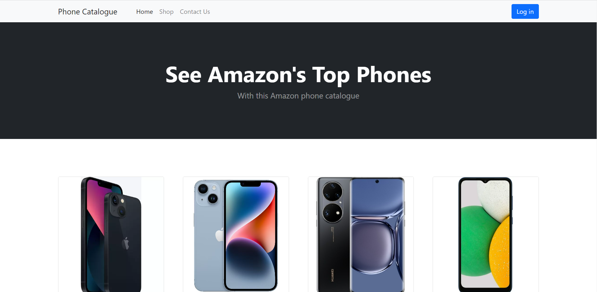

# ServerSide CA2

# Preview

# Getting Started

## Admin Login Details
Email: admin@gmail.com
Password: admin123

## Setup Instructions for database
- Create database using 'phone_shop.sql'
- Change details in database.php to your database details
- Access the project's index file location on the server 

## Application Features
- View Phone details from a database
- Filter Phones in the catalogue by operating system
- Filter phones in the catalogue by company
- Add phone records to the database
- Delete phone records from the database

# View the running application

Click the following link to see the application running: [Click here](https://mysql07.comp.dkit.ie/D00244618/ServerSideCA2/index.php)
